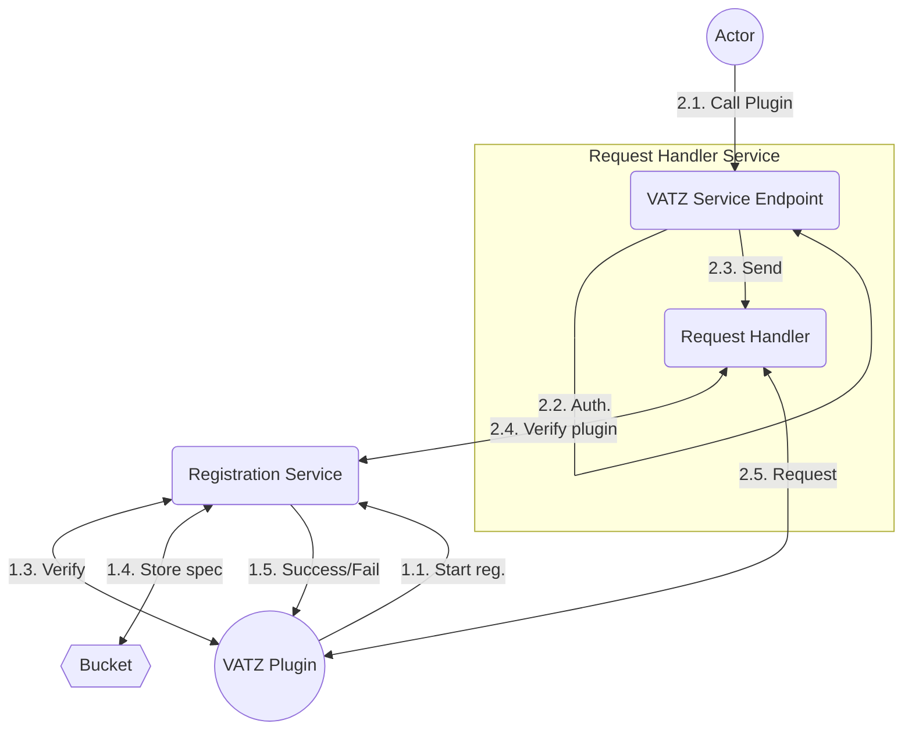

## Overall Components

### Registration Service

All plugins should be registered to VATZ cluster to list up to users. This component handles this registration process.
Moreover, this service provides query service of plugins. The query service will return list and detail specs of plugin, which registered on VATZ cluster.

**This service will interact with plugin directly through gRPC(http2.0) protocol to check the status of the plugin.**

Expected functions.
- RegisterPlugin
- ListPlugin

### Request Handler Service

#### VATZ Service Endpoint

The entry point of the VATZ cluster. Users will always access this service to interact with VATZ cluster. 
Basically, this module will handle authentication and rate limit features.

For convenience of the implementation, **VATZ Service Endpoint** will be implemented by *gRPC Gateway* by extracting protobuf.

Expected functions.
- ListPlugins
- GetPlugin
- RequestPluginCall
#### Request Handler

Core part to handle user requests. Basically it is implemented by gRPC service. 
When a request is delivered from user side, this component will proceed three major tasks.

First, the handler service will verify the requested plugin. Detail check list likes following. To handle the user request, the requested plugin should be alive. So this component is responsible to confirm liveness of the plugin.

If the requested plugin is valid, then this component will prepare calling the plugin function.
To do that, this component try to convert the user request into protobuf message format which is required to call the gRPC service.

At last, this component will send gRPC request to the plugin and will get a response which will be delivered to the origin user.

## What to do next?
- Before resolving technical issues, implementing pilot in one components.
